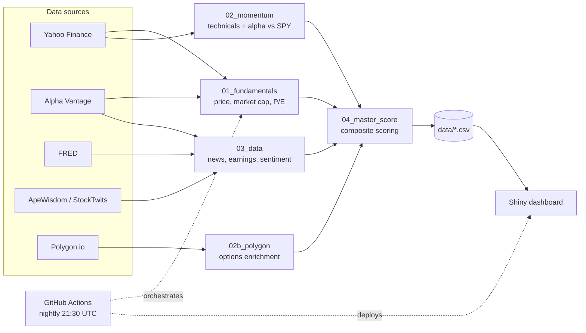

# EdgeScreener

A quantitative equity screener that scores a 195-stock universe on risk-adjusted
alpha, refreshes itself every night without human involvement, and publishes the
result as a live dashboard.

**Live app:** https://r-codescreener.shinyapps.io/r-codescreener/

Every trading day at 21:30 UTC a GitHub Actions workflow pulls fresh market data,
recomputes the model, commits the results, and redeploys the app. No local machine
is involved at any point.

---

## What it does

The model ranks stocks by *realized excess return versus SPY*, not by raw price
performance. A stock that returned 15% in a market that returned 14% scores worse
than one that returned 6% in a market that returned 2%.

Five surfaces sit on top of that:

| Tab | Purpose |
|---|---|
| **Overview** | Top 20 by composite score, top 15 small-cap growth ("Unicorns"), score distribution, sector heatmap |
| **Screener** | Full 195-name universe, filterable by sector, rating and minimum score |
| **Short / Squeeze** | Squeeze setup ranking from short interest, options positioning and volume |
| **Deep Dive** | Per-ticker price, MACD, RSI, Bollinger bands, valuation table, peer comps |
| **Macro** | Treasury curve, Fed funds, 10Y–2Y spread from FRED |
| **News & Events** | Market news with sentiment, earnings calendar, r/wallstreetbets and StockTwits trending |

---

## Architecture



The pipeline is five R modules run in sequence. Each writes CSV to `data/`, which
is committed back to the repo and copied into `app/` before deploy — so the app is
a pure read of pre-computed state and stays fast regardless of API latency.

---

## Scoring methodology

**Composite score** (`R/04_master_score.R`):

```
final_score = alpha_score  × 0.61     # options feed inactive (default)
            + tech_filter  × 0.24
            + quality_gate × 0.15

final_score = alpha_score    × 0.55   # options feed carrying information
            + tech_filter    × 0.22
            + quality_gate   × 0.13
            + options_signal × 0.10
```

The options term is only included when it actually varies across the universe.
On a free Polygon key the options snapshot endpoint returns nothing, so every
stock falls back to an identical 50 — a constant that took 10% of the weight
while distinguishing nothing, compressing the score range by the same 10%. The
run detects this and redistributes that weight across the three components that
do carry signal; configuring a paid Polygon key reactivates the term with no
code change. Each run logs which weighting it used.

**Alpha score** is a percentile blend of five measures computed from the daily
excess-return series:

```
alpha_raw = annualised_alpha × 0.30    # Jensen's alpha, CAPM-adjusted
          + information_ratio × 0.25   # alpha per unit of tracking error
          + hit_rate          × 0.20   # % of days the stock beat SPY
          + alpha_63d         × 0.15   # compounded alpha over one quarter
          + streak            × 0.10   # consecutive positive-alpha days
```

**Confidence weighting.** A short return series produces a noisy alpha estimate,
so the raw score is shrunk toward a neutral 50 in proportion to how much history
backs it:

```
alpha_score = alpha_raw × w + 50 × (1 − w),   w = min(days_tracked / 63, 1)
```

63 trading days is one quarter — the point at which the information ratio becomes
statistically meaningful. Below that the model deliberately refuses to express
conviction, which is why a newly added ticker cannot immediately rank first.

`data/alpha_history.csv` is rebuilt from the full one-year price window on every
run rather than appended one row at a time. That makes the series self-healing —
a missed or failed run is backfilled automatically — and means a ticker added to
the universe is judged on the same evidence as one tracked since day one.

---

## Data sources

| Source | Provides | Cadence | Notes |
|---|---|---|---|
| Yahoo Finance | Prices, market cap, P/E, EPS | Every run, all 195 | Via `quantmod` / `tidyquant` |
| Alpha Vantage `OVERVIEW` | P/B, ROE, margins, revenue growth, analyst ratings, sector | 22 tickers/run | Free tier is 25 calls/day; universe rotates in ~9 days |
| Alpha Vantage `NEWS_SENTIMENT` | Market news + sentiment | Daily | |
| Alpha Vantage `EARNINGS_CALENDAR` | Earnings dates, EPS estimates | Cached 3 days | 3-month horizon; refetching daily wasted quota |
| FRED | Treasury curve, CPI, unemployment, Fed funds | Daily | Via `quantmod::getSymbols(src="FRED")` |
| ApeWisdom | r/wallstreetbets mention counts and rank deltas | Daily | No key required |
| StockTwits | Trending symbols, bull/bear message sentiment | Daily | No key required |
| Polygon.io | Options positioning, SEC financials | Daily | **See limitations** |

All credentials are stored as GitHub Secrets and read via `Sys.getenv()`. No key
appears in source.

---

## Reliability engineering

This runs unattended, so most of the work is in failure handling:

- **Ragged upstream data.** Yahoo intermittently returns price bars with interior
  `NA`s, which makes every `TTR` indicator abort. Incomplete bars are dropped per
  symbol and each indicator is individually guarded, so one bad symbol cannot halt
  a run. This single failure mode caused every pipeline failure in the project's
  history before it was fixed.
- **Never destroy good data.** A fetch that returns empty keeps the previous file
  rather than overwriting it with a 0-row CSV, so a transient API failure degrades
  a panel to stale instead of blank.
- **Schema-tolerant parsers.** The StockTwits and Alpha Vantage news payloads carry
  nested `data.frame` columns whose shape varies between calls. Both are parsed
  from atomic vectors with per-field guards rather than a bulk coercion.
- **Cold-start safety.** Losing `data/av_cache.csv` used to abort the pipeline;
  every Alpha Vantage-derived column is now materialised up front so a missing
  cache degrades to neutral scores.
- **Observability.** Every run writes a data-health table (row counts, file age,
  status) to the workflow summary, so an empty or stale source is visible without
  reading logs.
- **Deploy.** Retries three times, then fails the run loudly rather than reporting
  green while the live site goes stale.

---

## Known limitations

Stated plainly because they affect how the output should be read:

- **No options data on the free Polygon tier.** Options snapshots and SEC
  financials are paid-tier endpoints, so `put_call_ratio`, `options_sentiment` and
  `avg_iv` are empty. The scoring model detects the dead feed and drops the term
  rather than letting a constant dilute every score, but the signal itself is
  genuinely missing until a paid key is configured.
- **Sector coverage is partial.** Sector comes only from Alpha Vantage, which
  refreshes 22 tickers per run, so recently added names show `—` until rotation
  reaches them.
- **Short interest is a stub.** No free API provides reliable short-float data. The
  field exists and is explicitly `NA` rather than being filled with a proxy.
- **The model does not demonstrate predictive skill.** This is the honest result
  of its own validation, not a caveat about it. Over 32 out-of-sample rebalances
  the score's rank information coefficient is +0.003 (t = 0.09), and testing each
  of the five alpha components separately finds none clearing |t| > 2 either. So
  the flat composite is not a weighting problem — trailing daily alpha simply does
  not predict forward excess return for this universe at a one-month horizon. The
  dashboard reports this rather than quoting the raw quintile spread.
- **The opposite hypothesis fails too.** The component diagnostic showed the
  positive-alpha streak carrying the largest magnitude and a negative sign,
  pointing against the momentum premise, so short-term reversal was tested across
  4 formation windows at a Bonferroni-adjusted |t| > 2.5. Nothing clears it; the
  strongest is the 10-day window at t = -1.53. Every window does carry a negative
  sign, but the windows overlap and read the same returns, so their agreement is
  correlated by construction and is not independent confirmation.

---

## Running locally

```bash
Rscript -e 'install.packages(c("quantmod","tidyquant","dplyr","tidyr","readr","httr","jsonlite","glue","lubridate","TTR","shiny","DT","plotly","ggplot2","scales"))'
```

```bash
export AV_KEY=your_alpha_vantage_key
export POLY_KEY=your_polygon_key
Rscript -e 'SOURCED_BY_MASTER <- TRUE; for (f in list.files("R", full.names=TRUE)) source(f); fund <- run_module1(); run_module2(fund$symbol); run_module_polygon(fund$symbol); run_module3(fund$symbol); run_module4()'
```

```bash
Rscript -e 'shiny::runApp("app")'
```

Tests:

```bash
Rscript -e 'testthat::test_dir("tests/testthat")'
```

---

## Repository layout

```
R/                     pipeline modules, run in numeric order
  01_fundamentals.R    universe definition, Yahoo + Alpha Vantage merge
  02_momentum.R        technicals, alpha vs SPY, history rebuild
  02b_polygon.R        options / SEC enrichment (endpoint-probing)
  03_data.R            macro, news, earnings, social sentiment
  04_master_score.R    composite scoring, ratings, Unicorn screen
app/                   Shiny dashboard (app.R, global.R) + deployed data
data/                  pipeline output, committed each run
tests/testthat/        unit tests for scoring math and parsers
.github/workflows/     nightly pipeline + deploy
```
